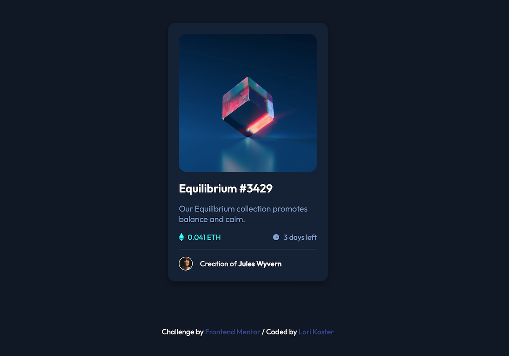

# Frontend Mentor - NFT preview card component solution

This is a solution to the [NFT preview card component challenge on Frontend Mentor](https://www.frontendmentor.io/challenges/nft-preview-card-component-SbdUL_w0U). Frontend Mentor challenges help you improve your coding skills by building realistic projects.

## Table of contents

- [Overview](#overview)
  - [The challenge](#the-challenge)
  - [Screenshot](#screenshot)
  - [Links](#links)
- [My process](#my-process)
  - [Built with](#built-with)
  - [What I learned](#what-i-learned)
  - [Continued development](#continued-development)
  - [Useful resources](#useful-resources)
- [Author](#author)
- [Acknowledgments](#acknowledgments)

## Overview

### The challenge

Users should be able to:

- View the optimal layout depending on their device's screen size
- See hover states for interactive elements

### Screenshot

### Links

- Solution URL: [https://github.com/lkoster/nft-preview-card-component-main](https://github.com/lkoster/nft-preview-card-component-main)
- Live Site URL: [https://lkoster.github.io/nft-preview-card-component-main/](https://lkoster.github.io/nft-preview-card-component-main/)

## My process

- I draw my planned elements on the provided picture, build my html page, copy classes to style.css, and start styling down the list to match the design.

### Built with

- Semantic HTML5 markup
- CSS custom properties
- Flexbox

### What I learned

I added useful comments to the html and css files explaining more details.

### Useful resources

- [MDN Docs](https://developer.mozilla.org/en-US/) - This is my number one go to for help.
- [Beautiful CSS box-shadow examples](https://getcssscan.com/css-box-shadow-examples) - I used this to find a good box shadow.

## Author

- Website - [Lori Koster](https://github.com/lkoster)
- Frontend Mentor - [@lkoster](https://www.frontendmentor.io/profile/lkoster)
